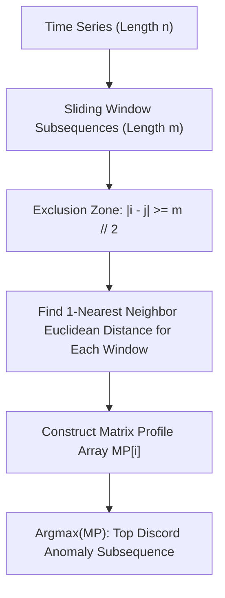

# genpark-matrix-profile-discord-anomaly-detector-skill

Agent Skill implementing the **Matrix Profile 1-NN Subsequence Distance Engine** for time-series discord anomaly discovery and motif detection without false positive trivial matches.

## Architectural Overview

